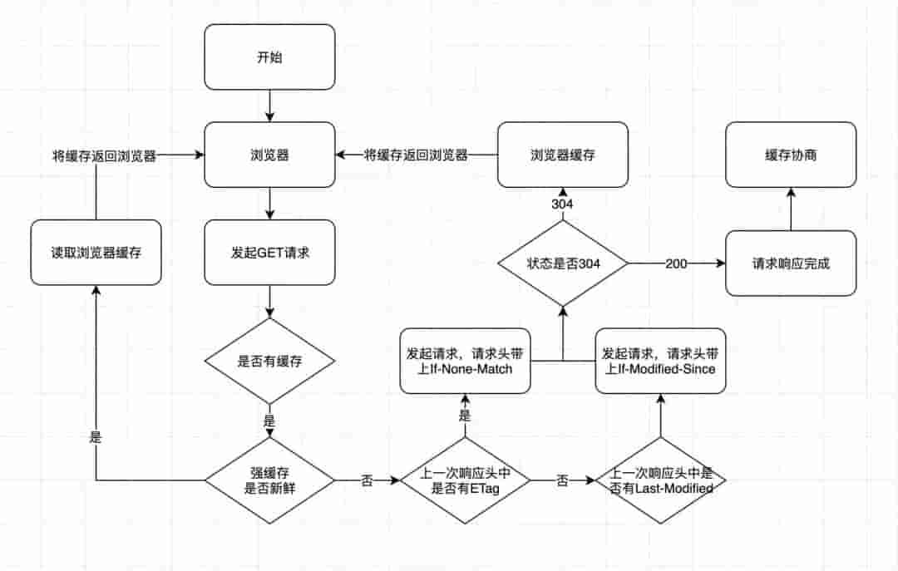

## HTTP缓存

HTTP缓存主要分为强缓存和协商缓存

主要作用是加快资源获取速度,提升用户体验,减少网络传输,缓解服务器压力

HTTP缓存流程图:

## 强缓存

不需要发送请求到服务端,直接读取浏览器本地缓存

是否强缓存由 Expires、Cache-Control、Pragma 三个 header属性共同来控制

### Expires

优先级在三个header属性中最低

Expires是http1.0的规范,它的值是一个绝对时间的GMT格式的时间字符串

根据系统时间和 Expires值进行比较,系统时间超过了 Expires值缓存就失效,由于和系统时间比较,所以当系统时间与服务器时间不一致的时候会有缓存有效期不准的问题

### Cache-Control

http1.1新增属性,在请求头和响应头中都可以使用:

+ max-age: 单位是秒,距离发起时间的秒数,超过秒数缓存失效
+ no-cache: 不使用强缓存,需要与服务器验证缓存是否新鲜
+ no-store: 直接禁止浏览器缓存数据,每次都向服务器请求最新的资源
+ public: 响应可以被中间代理、CDN等缓存
+ private: 专用于个人的缓存,中间代理、CDN等不能缓存此响应
+ must-revalidate: 在缓存过期前使用,过期后必须向服务器验证

### Pragma

优先级在三个header属性中最高

Pragma只有一个属性值,就是 no-cache,效果和 Cache-Control 中的 no-cache 一致,不使用强缓存,巫妖与服务器验证缓存是否新鲜

## 协商缓存

当浏览器强缓存失效或者请求头中设置了不走强缓存,并且在请求头中设置了 If-Modify-Since 或者 If-None-Match的时候,会将这两个属性值到服务端去验证是否命中协商缓存,如果命中了就返回304状态,加载浏览器缓存,并且响应头会设置 Last-Modified 或者 Etag属性

### Etag 和 If-None-Match

Etag/If-None-Match 是一串hash码,代表一个资源的标识符,当服务端文件发生变化,它的hash码会随之变化,通过请求头中的 If-None-Match 和当前文件的hash值进行比较,如果相等则表示命中协商缓存

Etag又有强弱校验之分,如果hash码以"W/"开头的一串字符串,说明此时协商缓存的校验是弱校验,只有服务器上的文件差异达到能够触发hash值后缀变化的时候,才会真正地请求资源,否则返回304并加载浏览器缓存

### Last-Modify/If-Modify-Since

Last-Modify/If-Modify-Since的值代表的是文件的最后修改时间,第一次请求服务端把资源的最后修改时间放到 Last-Modify响应头中,第二次发起请求时,请求头会带上上次响应头中的 Last-Modify的时间,并放到 If-Modify-Since请求头属性中,服务端根据问题最后一次修改时间和 If-Modify-Since的值进行比较,如果相等返回304,并加载浏览器缓存

## ETag/If-None-Match

ETag/If-None-Match 的出现主要解决了 Last-Modified/If-Modified-Since 所解决不了的问题：

+ 如果文件的修改频率在秒级以下, Last-Modified/If-Modified-Since 会错误地返回 304
+ 如果文件被修改了,但是内容没有任何变化的时候, Last-Modified/If-Modified-Since 会错误地返回 304

在没有提供任何浏览器缓存过期策略的情况下,浏览器遵循一个启发式缓存过期策略:

**根据响应头中2个时间字段Date和 Last-Modified之间的时间差值,取其值的10%作为缓存时间周期**